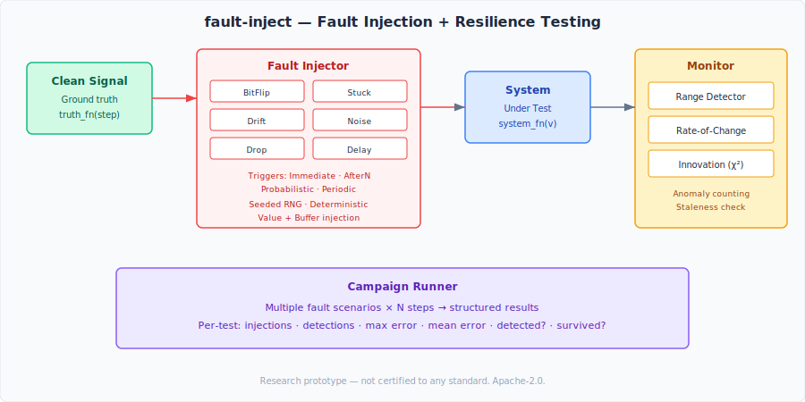

# fault-inject

A fault injection and resilience testing framework for avionics research. Inject bit flips, sensor drift, stuck values, noise, and message drops — then measure how your system degrades.

## What This Is

`fault-inject` provides a systematic way to test safety-critical pipelines under fault conditions:

- **Injection** — Bit flips, stuck values, drift accumulation, noise amplification, message drops, timing delays
- **Triggers** — Immediate, after-N, probabilistic, periodic activation modes
- **Monitoring** — Range/rate anomaly detection, chi-squared innovation monitoring for Kalman filter consistency
- **Campaigns** — Automated multi-scenario test execution with structured reporting

The question this answers: "What happens when things go wrong?" Test your estimation, communication, and rendering pipelines under realistic fault conditions.

## Architecture



```
include/fault/
├── types.hpp                    # FaultKind, TriggerMode, Severity, FaultEvent
├── inject/
│   └── injector.hpp             # Value + buffer fault injection (bitflip, stuck, drift, noise)
├── monitor/
│   └── detector.hpp             # RangeDetector + InnovationMonitor (chi-squared NIS)
└── scenario/
    └── campaign.hpp             # Automated fault injection test campaigns
```

## Quick Start

```bash
mkdir build && cd build
cmake .. -DCMAKE_BUILD_TYPE=Release
cmake --build . -j$(nproc)

# Run tests
./test_fault

# Run resilience demo (4 fault scenarios against a sensor pipeline)
./resilience_demo
```

## Demo Output

```
=== Fault Injection Resilience Demo ===
Testing sensor pipeline under 4 fault scenarios

Test                      Fault      Severity  Injects  Detects     MaxErr    MeanErr  Detect? Survive?
bitflip_1bit              bit_flip   minor          20        0     0.0000     0.0000       no      YES
noise_20m                 noise      minor        2000     1667    75.8770    16.1618      YES      YES
drift_0.1m_per_step       drift      major        2000        0   200.0000   100.0500       no      YES
stuck_at_first_reading    stuck      hazard       1950        0   368.2940   166.4449       no      YES
```

Key findings from the unfiltered (worst-case) pipeline:
- **Bit flips** (1-bit mantissa): Undetectable, negligible error — benign
- **Noise** (σ=20m): Detected by range monitor, system survives
- **Drift** (0.1m/step): Accumulates to 200m error, undetected by range check alone — needs innovation monitoring
- **Stuck sensor**: 368m max error, undetected — needs staleness/rate detection

## Fault Types

| Fault | What It Does | Use Case |
|-------|-------------|----------|
| `BitFlip` | Flips bits in IEEE 754 mantissa or raw buffer | SEU simulation, memory corruption |
| `Stuck` | Freezes output at first captured value | Sensor failure, ADC latch-up |
| `Drift` | Accumulates bias over time | Gyro drift, calibration degradation |
| `Noise` | Adds Gaussian noise with configurable σ | EMI, sensor degradation |
| `Drop` | Silently drops messages | Communication loss, bus fault |
| `Delay` | Injects timing delays | Scheduling overrun, bus congestion |

## Test Results

| Test | Result | Notes |
|------|--------|-------|
| Bit flip injection | ✅ | Single-bit mantissa flip verified |
| Stuck fault | ✅ | Value frozen after first sample |
| Drift accumulation | ✅ | Linear bias growth confirmed |
| Probabilistic trigger | ✅ | 50.4% fire rate at p=0.5 |
| Range detector | ✅ | Out-of-range and rate violations detected |
| Campaign execution | ✅ | Multi-scenario run with structured reporting |

> **Note:** Measurements taken on a single Azure VM (Intel Xeon Platinum 8370C, Linux 6.14). Results are reproducible under controlled conditions but may vary across platforms.

## Design Constraints

- C++23, CMake ≥ 3.25
- `-Wall -Wextra -Wpedantic -Werror`
- Header-only (no separate compilation)
- No dynamic allocation in injection hot paths
- Deterministic: seeded RNG produces identical fault sequences
- `CLOCK_MONOTONIC` for all timestamps

## Dependencies

None. Pure C++23 standard library.

## Portfolio Context

`fault-inject` is part of the [avionics-lab](https://github.com/yablokolabs/avionics-lab) research portfolio:

| Repository | Role |
|-----------|------|
| [partition-guard](https://github.com/yablokolabs/partition-guard) | Time/space isolation |
| [comm-bus](https://github.com/yablokolabs/comm-bus) | Deterministic data bus |
| [virt-jitter-lab](https://github.com/yablokolabs/virt-jitter-lab) | Virtualization latency measurement |
| [wcet-probe](https://github.com/yablokolabs/wcet-probe) | Execution timing characterization |
| [track-core](https://github.com/yablokolabs/track-core) | Probabilistic state estimation |
| [detframe](https://github.com/yablokolabs/detframe) | Deterministic rendering |
| **fault-inject** | **Fault injection and resilience testing** |

Pipeline: **isolate → connect → characterize → validate → track → render → stress test**

## Roadmap (v2)

- Byzantine fault injection (inconsistent values to different readers)
- Temporal fault injection (clock skew, timer drift)
- Integration with track-core (inject faults into Kalman filter pipeline)
- Integration with comm-bus (inject faults at the message transport layer)
- HTML/JSON campaign reports

## License

Apache-2.0. See [LICENSE](LICENSE).
